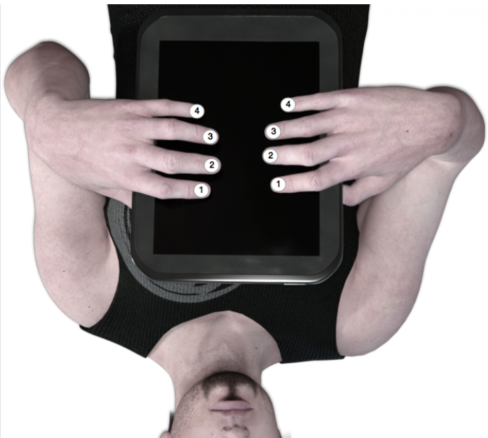
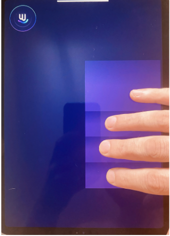

# Monoleap

Monoleap is a MIDI controller app for the iPAD designed for playing monophonic sounds (bass / lead synths, sampled wind / string instruments etc.). I designed the instrument so that you can play without having to look at the device, playing any melody you like in a 4 octave range while changing the sound and expression by just moving your hands intuitively with the music.

Check out the demonstration videos:

https://youtu.be/anzcbBjzgnE?si=QNg2jckLnXfFuCKP
https://youtu.be/Ye2kVmR8nlc?si=500OOn8tj3qJX1Wz
I

Monoleap comes with a built in synth sound that will help you get started exploring the instrument quickly. Once you are acquainted with the instrument, I recommend you use monoleap as a MIDI controller for playing your favorite software instruments, as will be explained later in this guide.

## Leading Hand Selection (Left handed support)

When playing the Monoleap, one hand is the leading hand. By default Monoleap is configured to use the right hand as the leading hand. This can be changed in the “Instrument Settings” page by setting the “Leading Hand” option to “Left”. This guide will provide two fingering charts further below. Use the one applicable for your leading hand selection.

Once your leading hand is selected, go directly to the instrument screen by pressing the round ‘play’ button in the bottom right corner of the settings screen

## Hand Size Calibration

Monoleap needs to be adjusted to fit your hand size so that it can know the relative distance between your fingers and detect the patterns you play correctly. 

Hold down finger 1 (index finger) of your selected leading hand only against the screen. The screen will then show you the 4 finger guides (see picture on the right). 
When calibrated correctly, each of your fingers should be positioned more or less in the center of each rectangle. If that’s not the case, hold all 4 playing fingers of your leading hand (all fingers except your thumb) on the screen in a comfortable, slightly curved manner, with the fingers not too close together but not too far apart, as shown in the figure on the right,  for more than a second. The finger guides will automatically align to your hand size and the calibration info will be stored. Note that the calibration is performed only using your leading hand but will affect both hands.

The finger guides can be helpful to check the device calibration, but are not required to play the instrument. You can play anywhere on the screen without looking at the device and the guides will follow your hand positions. You can turn off the guides completely in the instrument settings screen by setting the “Show Pattern Guides” option to “Off”

To avoid accidentally changing the calibration while playing, turn off the  ‘Calibration Enabled’ option in the settings screen once you are satisfied with the calibration.

## Finger Patterns

The pattern sheets in the following pages will show you how to play all notes in a 4 octave range. Use the chart applicable for your selected leading hand (see leading hand selection above). 

You will notice that the patterns repeat themselves. There are 6 basic patterns that repeat chromatically, and 2 extra patterns used only on the left hand for playing an additional octave.

Whatever note you play, both your left and right index fingers (finger 1) will always be pressed against the screen. This allows you to use the movements of those fingers to change the device sound. When you move your leading hand (right by default) up and down it changes the built in synth’s filter cutoff. 
The more you move the finger down the louder the sound becomes. This allows you to apply a sort of ‘vibrato’ to your performance, adding feel and emotion. The movements of your index finger on the following hand (left by default) are mapped to the synth’s filter resonance, making the sound more aggressive and edgy the more you move the finger downwards. 

When using Monoleap as a MIDI controller, you can map both X and Y positions of both hands to 4 synth parameters. I'll explain how to set up Monoleap MIDI with a software instrument in the next section.

### Right Handed Patterns

### Left Handed Patterns

## Setting up MIDI

Monoleap is first and foremost a MIDI controller, capable of playing any software or hardware sound module. This section will show you how to set up MIDI control.

### Using an iPAD Software Instrument

For best performance, use monoleap for playing an iPAD software instrument. I recommend the Minimoog Model D synthesizer.  It’s a great instrument on it’s own, but combined with Monoleap, you can create a performance that’s rich in emotion and expression. It’s not free, but not too pricey either. Other instruments have similar settings, so you can probably apply this to any other app as well.

Install Minimoog Model D from the App Store
Enable background audio (so that the app can produce sound when in background) by going to the settings page (cogwheel icon) → Configuration → turn on Background Audio
Select a patch - a good patch to get started with is LEADS → FANFARE

Note that the model D is mapped by default to receive controller change messages for filter cutoff (CC #74) and resonance (CC #71). The monoleap also maps these by default to the right and left vertical finger movements respectively. You can experiment with mapping additional synth parameters to X and Y finger positions in the MIDI settings page as explained further below.

Make sure you turn off the built in synth sound in the instrument settings screen before you play an external instrument. You can go to the settings screen by pressing the “m” button (the button appears after a second when your hands are not playing the instrument).

### Using a Mac / PC

Monoleap can also send MIDI data to a Mac or PC by using a cable (Lightning / USB-C) or wirelessly (Bluetooth / WiFi). 
To connect your iPAD to a Mac, simply attach the iPad using the lightning / USB-C cable, then enable your iPad in the Audio MIDI Setup audio devices list (this will also connect MIDI). You can then use monoleap to play any desktop software instrument.
To connect wirelessly, use the free Bluetooth MIDI Connect app from Korg, as explained in their user manual.

## Instrument Settings

Go to the instrument settings page by pressing the “Instrument” button on the bottom left page selector buttons.

The instrument settings page contains the following settings:

### General Settings

* Internal Synth (On / Off) - Enable or disable the internal synth sound
* Show Pattern Guides (On / Off) - Enable or disable showing the pattern guide rectangles while you play
* Calibration Enabled (On / Off) - Enable or disable calibration (useful to avoid accidental calibration while resting your fingers on the screen)
* Leading Hand (Left / Right) - The leading hand selection. Patterns will be played according to the leading hand. Set this to “Left” if you are left handed.

### Scale Lock

The scale selector allows you to lock Monoleap to a scale, reducing the chance of playing the wrong notes when performing using a single scale. This feature only controls which notes will be played by the instrument and does not affect the fingerings. By default, Chromatic is selected, meaning that all notes are played. You can select one of the predefined scales in the dropdown on the top left and the scale root in the dropdown on the top right. You can also tap the individual notes to enable / disable them.

### MIDI Settings

The MIDI settings page is shown when selecting the ‘MIDI’ page using the page selection buttons (bottom left corner of the screen)
It contains the following settings, divided to three sections:

#### General MIDI Settings

* MIDI Enabled (On / Off) - Enable or disable MIDI sending
* MIDI Channel (1 - 16) - Select the midi channel Monoleap transmits to 

#### Right Hand Settings

* X CC Enabled (On / Off) - Enable or disable sending MIDI controller change messages when the right hand is moved horizontally on the screen.
* X CC Value (0 - 127) - The MIDI controller number to send when moving the right hand horizontally on the screen.
* Y CC Enabled (On / Off) - Enable or disable sending MIDI controller change messages when the right hand is moved vertically on the screen.
* Y CC Value (0 - 127) - The MIDI controller number to send when moving the right hand vertically on the screen.

#### Left Hand Settings

* X CC Enabled (On / Off) - Enable or disable sending MIDI controller change messages when the left hand is moved horizontally on the screen.
* X CC Value (0 - 127) - The MIDI controller number to send when moving the left hand horizontally on the screen.
* Y CC Enabled (On / Off) - Enable or disable sending MIDI controller change messages when the left hand is moved vertically on the screen.
* Y CC Value (0 - 127) - The MIDI controller number to send when moving the left hand vertically on the screen.

Note: Each MIDI CC selector provides a “TRANSMIT” button which can be used to invoke MIDI learn operation on your software or hardware synths.

## Theme Selection

The theme selection page is shown when pressing the “Theme” page selection button (located in the bottom left corner of the screen)

Select one of the provided visual themes to change how your playing is visualized on the screen. 

